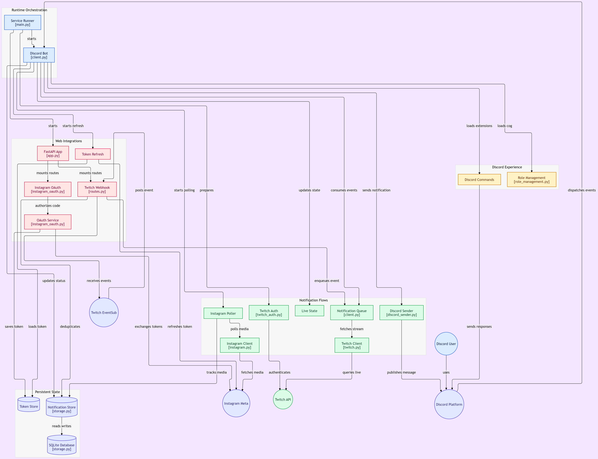

# Morcegão

O Morcegão é um projeto de bot para Discord com automações de comunidade, integrações com Twitch e Instagram e uma camada web para webhooks e monitoramento local.

## Visão geral

O bot centraliza ações de moderação, interações com membros, notificação de lives e acompanhamento de conteúdo de mídia em plataformas externas. A arquitetura foi organizada em módulos para separar: cliente Discord, integrações externas, armazenamento persistente, webhooks e tarefas agendadas.



## Principais funcionalidades

- Bot em Python com comandos slash do Discord
- Notificações automáticas quando uma live da Twitch começa
- Monitoramento de conteúdo novo em conta Instagram profissional
- Sistema de cargos automáticos e reações em mensagens
- Canais de voz temporários
- Logs de entrada/saída de membros
- Integração com FastAPI para endpoints de webhook e saúde local
- Persistência com SQLite para tokens e dados do sistema

## Estrutura do repositório

```text
morcegao/
├── README.md
├── diagram.png
├── docs/
├── discord-bot/
│   ├── README.md
│   ├── pyproject.toml
│   ├── src/
│   ├── tests/
│   └── data/
└── output/
```

A implementação principal do bot está em [discord-bot/README.md](discord-bot/README.md) e em seu código-fonte em [discord-bot/src](discord-bot/src).

## Arquitetura resumida

- Cliente Discord: responsável pelos comandos, eventos, reações e cargos automáticos
- Twitch: EventSub e validação/refresh de tokens para detectar lives e publicar eventos
- Instagram: polling oficial da Meta para identificar novas mídias em conta autorizada
- Web layer: endpoints FastAPI para receber webhooks, saúde do sistema e integrações locais
- Storage: SQLite para dados permanentes, tokens e informações de contexto
- Tasks: rotinas periódicas para sincronização e reforço de autenticação

## Executando o projeto

A forma mais direta de rodar o bot é dentro da pasta do projeto principal:

```bash
cd discord-bot
python -m venv .venv
source .venv/bin/activate   # Linux/macOS
# ou
.\.venv\Scripts\Activate.ps1  # Windows PowerShell
python -m pip install --upgrade pip
python -m pip install -e ".[dev]"
```

Em seguida, configure as variáveis de ambiente e siga as instruções detalhadas em [discord-bot/README.md](discord-bot/README.md).

## Documentação

- [discord-bot/README.md](discord-bot/README.md) — guia completo de instalação, configuração e integrações
- [docs](docs) — materiais e documentação complementar

## Licença

Este projeto inclui a licença do bot em [discord-bot/LICENSE](discord-bot/LICENSE).
