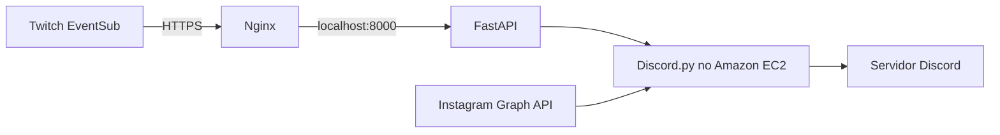

# Weekend Deployment Challenge: Morcegão

#deployment

## O que o aplicativo faz

Morcegão é um bot para Discord criado para centralizar novidades de uma comunidade. Do ponto
de vista de quem participa do servidor, ele oferece comandos slash como `/ping`, `/comandos`,
`/boasvindas`, `/reenviar_live` e `/limpar`. Além dos comandos, ele acompanha uma transmissão
configurada na Twitch e publica uma notificação quando a live começa. O projeto também pode
consultar uma conta profissional do Instagram pela API oficial da Meta para avisar sobre novas
publicações. Há ainda recursos voltados à comunidade: canais de voz temporários e reações
automáticas VAMPI em imagens, GIFs e vídeos enviados em um canal específico.

A ideia foi evitar que moderadores precisem repetir avisos manualmente ou manter vários serviços
desconectados. O bot recebe eventos da Twitch, consulta o Instagram em intervalos controlados e
entrega mensagens no Discord. Cada integração pode ser ativada ou desativada individualmente por
variáveis de ambiente. Assim, o Discord continua disponível mesmo quando Twitch ou Instagram não
são necessários. Também foi importante manter segredos fora do código: tokens são lidos do
ambiente e nunca são incluídos nos logs.

## Como construí

Desenvolvi o projeto em Python 3.12 com `discord.py` 2.x, usando programação assíncrona para que
o gateway do Discord, o webhook HTTP e as tarefas periódicas convivam no mesmo processo. A classe
principal estende `commands.Bot`, concentra os intents necessários e carrega funcionalidades como
cogs. Essa organização permitiu separar comandos gerais, canais de voz temporários e reações de
mídia sem criar outro cliente Discord.

Um desafio importante foi publicar um webhook que a Twitch conseguisse alcançar sem expor a API
local diretamente. A aplicação FastAPI inicia junto do bot e escuta apenas em `127.0.0.1:8000`.
Para a Twitch EventSub, implementei validação de assinatura e respostas apropriadas ao desafio de
verificação. Para o Instagram, escolhi polling pela API oficial em vez de scraping. O projeto
também trata falhas de rede e permissões do Discord, registra detalhes técnicos de forma segura e
apresenta respostas simples aos membros.

Durante a implantação, a principal lição prática foi executar o bot como um serviço gerenciado,
e não deixar um terminal SSH aberto. Usei um ambiente virtual isolado, um usuário de sistema sem
privilégios administrativos e um serviço `systemd` com reinício após falha. Isso torna reinícios
previsíveis e mantém o processo ativo após encerrar a sessão SSH. Os testes unitários usam mocks,
portanto não fazem conexão real com Discord, Twitch, Instagram ou Meta durante o desenvolvimento.

## Serviços AWS usados e arquitetura

O aplicativo foi implantado em uma instância Amazon EC2 executando Amazon Linux 2023. A EC2 é o
processo de computação persistente que executa Python, Discord.py, FastAPI, o serviço systemd e
Nginx. A VPC e o Security Group restringem a entrada: SSH fica limitado ao administrador, enquanto
HTTP e HTTPS são usados pelo desafio de certificado e pelo endpoint público da Twitch. A porta
8000 não é exposta para a internet.

O Nginx atua como proxy reverso na própria EC2. Ele recebe tráfego HTTPS no endpoint
`/webhooks/twitch` e encaminha somente essa rota para a FastAPI local. Um certificado TLS do
Let's Encrypt protege o domínio público. O DNS dinâmico DuckDNS foi usado como uma alternativa
acessível para apontar um subdomínio público para a instância. Em uma evolução futura, o token
renovável do Instagram pode ser armazenado no AWS Secrets Manager com uma IAM Role da EC2, em vez
de depender do arquivo `.env` local.

## O que aprendi

Este deploy reforçou a diferença entre executar uma aplicação localmente e operá-la de maneira
contínua. Aprendi a usar Security Groups para expor apenas o necessário, a manter a aplicação
atrás de um proxy reverso e a configurar certificados TLS renováveis. Também ficou mais claro por
que variáveis de ambiente, permissões mínimas e logs sem segredos são partes do produto, não
detalhes opcionais.

No código, aprendi a combinar o ciclo de vida do Discord.py com FastAPI no mesmo loop assíncrono,
sem duplicar o cliente do Discord. A sincronização de comandos slash em um servidor de
desenvolvimento tornou a iteração mais rápida, enquanto o uso de testes, Ruff e type hints ajudou
a manter as mudanças seguras. A experiência mostrou que uma aplicação pequena pode ser realmente
útil quando tem um escopo claro, documentação e um caminho de operação simples.

## Links

- Código-fonte: [https://github.com/FelipeNCampos/morcegao](https://github.com/FelipeNCampos/morcegao)
- O repositório público abaixo contém o código e as instruções de execução.
